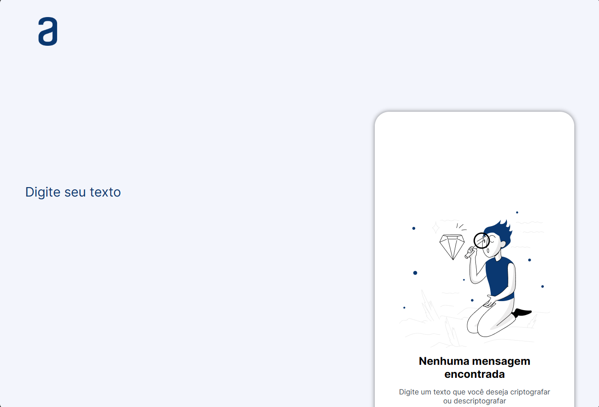

# Final Challenge - Text Encryption and Decryption 🔐

## Project Description

This is the repository of the final challenge of the "Beginner in Programming T6 - ONE" course from Alura, where you had the opportunity to apply all the knowledge acquired in HTML, CSS, and JavaScript to create a web page that allows encrypting or decrypting texts.

### Key Features 🚀

- Encrypt and decrypt texts using specific algorithms.
- User-friendly interface based on the visual design created in Figma.
- Full integration between HTML, CSS, and JavaScript.

## Technologies Used

- HTML5
- CSS3
- JavaScript

## Project Structure

- `index.html`: Main file of the web page.
- `styles.css`: Stylesheet responsible for the page design.
- `script.js`: JavaScript script for encryption and decryption functionalities.

## Screenshots

## License

This project is licensed under the MIT License. See the [LICENSE](LICENSE) file for more information.

---

Developed by [Ruan Cláudio Damasceno Souza](https://www.linkedin.com/in/-ruanclaudio-/) 😄🚀
